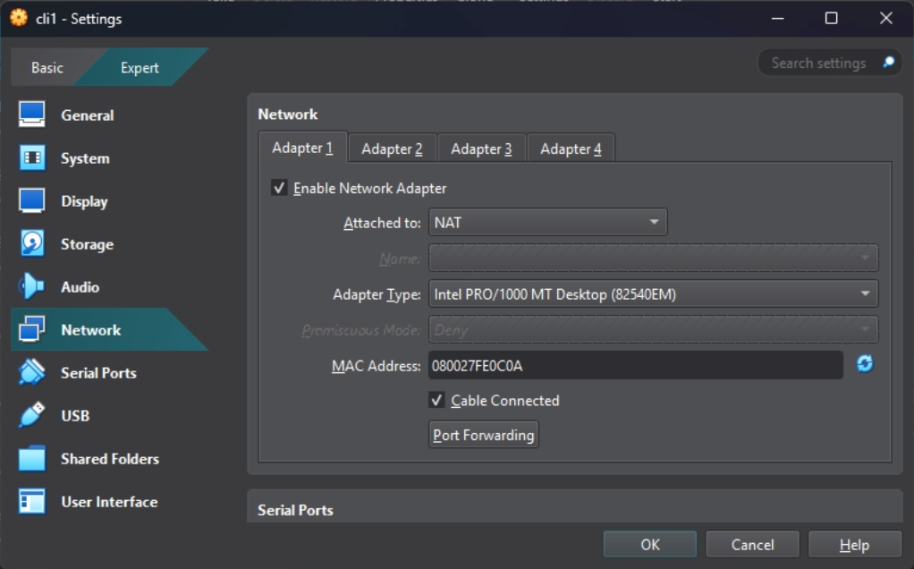
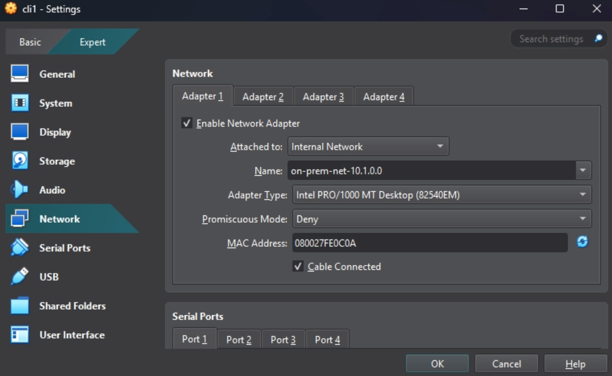
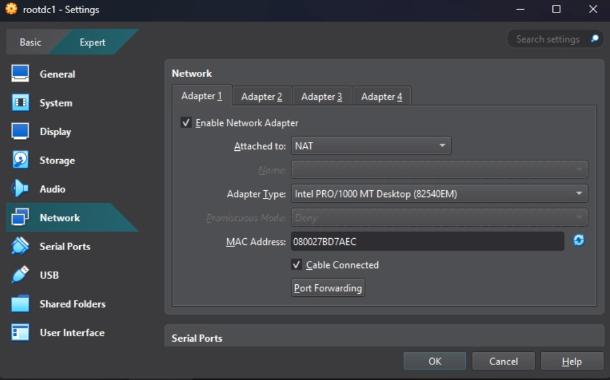
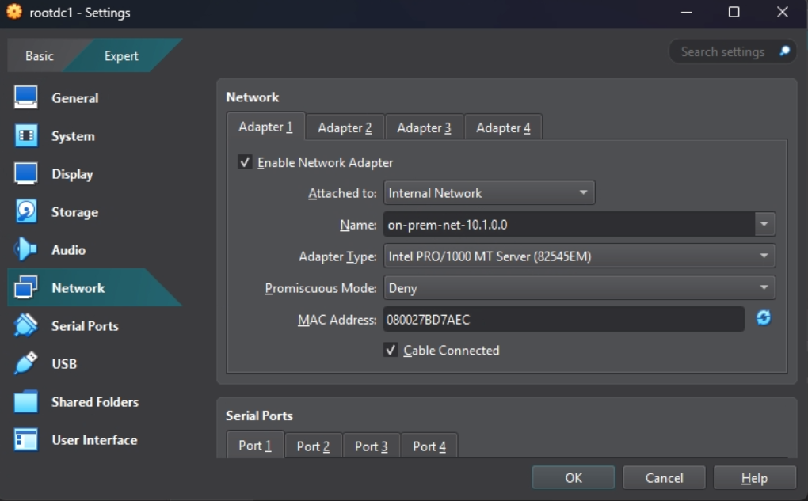
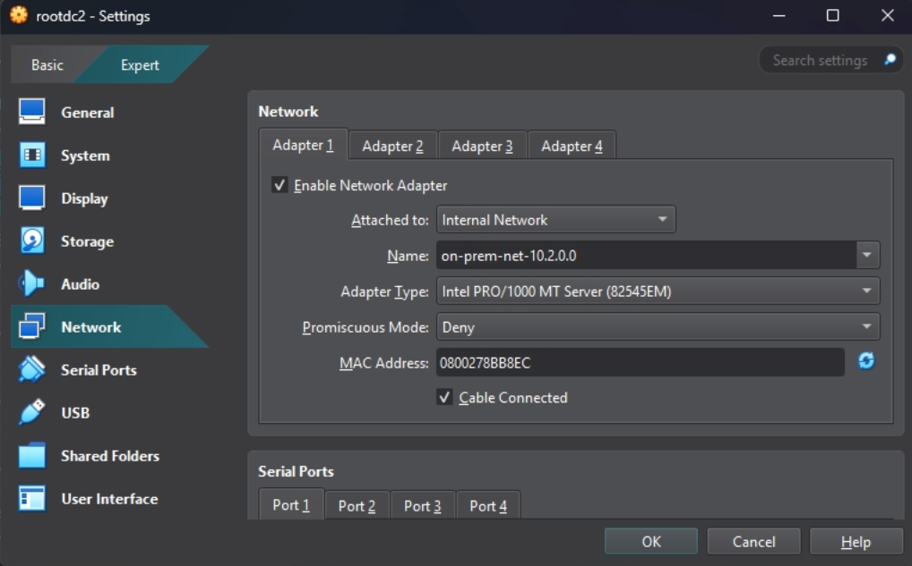
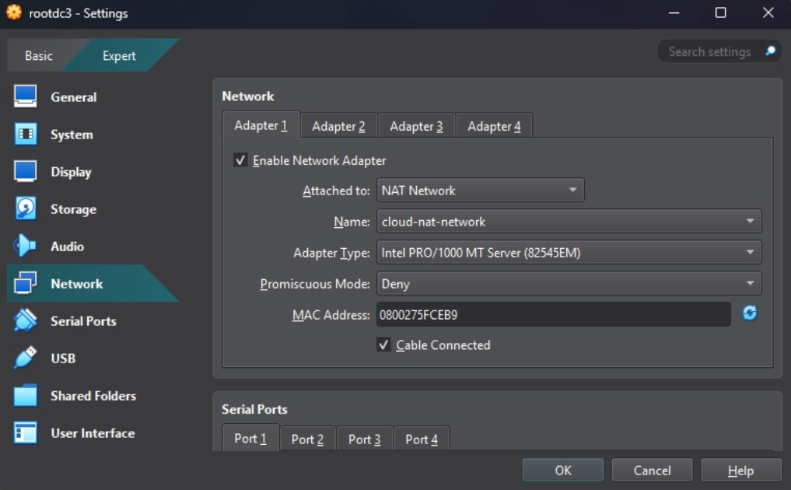
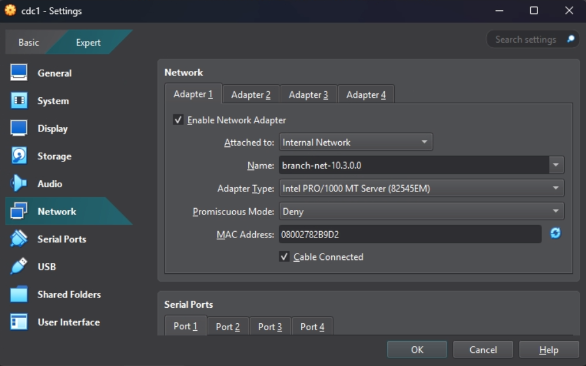
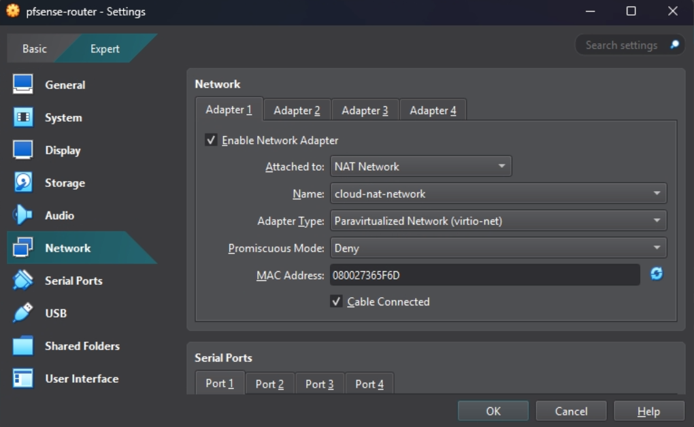
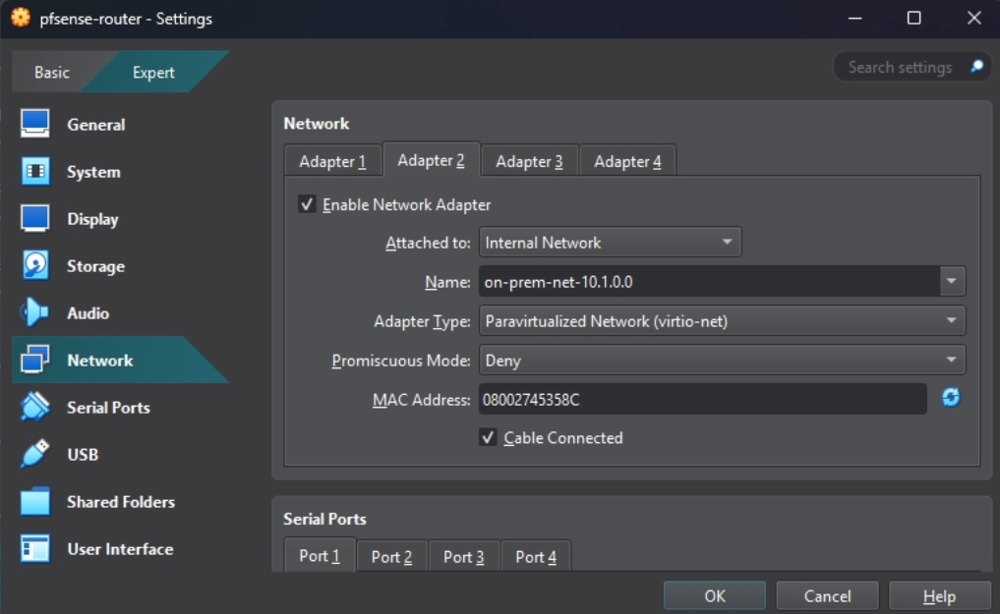
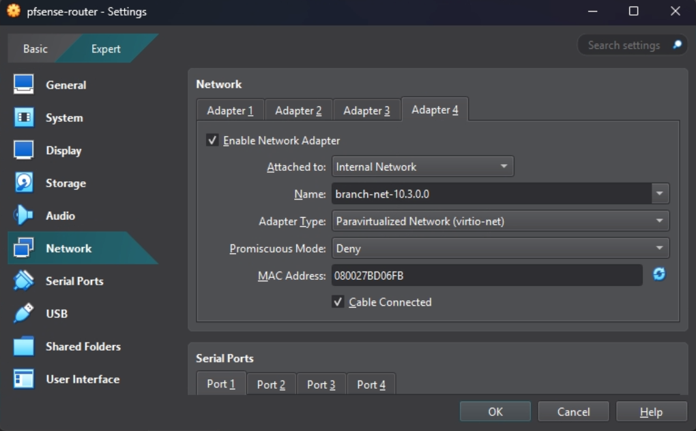

# VirtualBox Hybrid Cloud Lab

This document outlines the steps to create a hybrid cloud environment.

## Part 1: VirtualBox Network Configuration

This part focuses on setting up the necessary networks within VirtualBox.

1. **Open VirtualBox Manager:**
    - Open the VirtualBox application.

2. **Create NAT Network:**
    - Navigate to the NEtwork Manager: Go to 'Tools' -> 'Network'.
    - Select the "NAT Networks" tab.

    

    - Click the "Create" button to add a new NAT network.
    - Rename the newly created network to 'cloud-nat-network'.
    - Set the IPv4 Prefix to '172.16.0.0/24'.
    - Ensure that the "Enable DHCP" checkbox is checked.

    

    - Click "Apply"

    **Note:** Internal networks will be defined implicitly during the VM configuration process.

## Part 2: Create Virtual Machines

This part involves creating the eight virtual machines needed for the lab environment. We'll be using the new VM creation wizard in VirtualBox 7.x and the clone feature for efficiency.

1. **Create 'cli1' (Windows 11 Client):**
    - Click 'Machine' -> 'New' button in VirtualBox Manager.

    

    - In the "Name and Operating System" secion:
        - **Name:** 'cli1'
        - **Folder:** (Choose where to store the VMs)
        - **ISO Image:** (Leave blank)
        - **Type:** 'Microsoft Windows'
        - **Version:** 'Windows 11 (64-bit)'
        - **Skip Unattended Installation:** Ensure this is *unchecked*

    

    - Hardware
        - **Base Memory:** '4096 MB'
        - **Processors:** (Leave at default)

    

    - Hard Disk
        - **File Size:** '64 GB'

    

    - Click 'Finish' to create the virtual machine.

    

2. **Create 'rootdc1' (Base Windwos Server VM):**
    - Click 'Machine' -> 'New' in VirtualBox Manager.
    - In the "Name and Operating System" section:
        - **Name:** 'rootdc1'
        - **Folder:** (Same as previous)
        - **ISO Image:** (Leave blank)
        - **Type:** 'Microsoft Windows'
        - **Version:** 'Windows Server 2022 (64-bit)'
        - **Skip Unattended Installation:** Unchecked
    - Hardware
        - **Base Memory:** '2048 MB'
        - **Processors:** (Default)
    - Hard Disk
        - **File Size:** '50 GB'
    - Click "Finish"

3. **Clone 'rootdc1' to Create Other Server VMs:**
    - Right-click on the 'rootdc1' VM in the VirtualBox Manger and select "Clone...".

    

    - **Clone 'rootdc2':**
        - **Name:** 'rootdc2'
        - **Path:** (Same as previous)
        - **Clone Type:** 'Full Clone'
        - **MAC Address Policy:** Select "Generate new MAC addresses for all network adapters"
        - **Keep Disk Names:** Checked

    

        - Click "Finish"
    
    - **Repeat:** Repeat the cloning process for 'rootdc3', 'cdc1', crodc1', and 'acqdc1', changing the *Name* in the "Clone Virtual Machine" dialog each time, but keeping all other settings the same (especially "Generate new MAC addresses...").

4. **Create 'pfsense-router':**
    - Click 'Machine' -> 'New' in VirtualBox Manager.
    - In the "Name and Operating System" section:
        - **Name:** 'pfsense-router'
        - **Folder:** (Same as previous)
        - **ISO Image:** (Leave blank)
        - **Type:** 'Linux'
        - **Subtype:** 'Other Linux'
        - **Version:** 'Other Linux (64-bit)'
        - **Skip Unattended Installation:** Unchecked
    - Hardware
        - **Base Memory:** '1024 MB'
        - **Processors:** (Default)
    - Hard Disk
        - **File Size:** '10 GB'
    - Click "Finish"

### Configuring Network Adapters

Now we'll configure the network adapters for each VM.

1. **Configure 'cli1':**
    - Select the 'cli1' VM in VirtualBox Manager.
    - Click 'Settings'.
    - Toggle 'Expert' mode.
    - Click 'Network'.
    - Select the 'Adapter 1' tab.

    

    - **Enable Network Adapter:** Check this box.
    - **Attached to:** Select 'Internal Network'.
    - **Name:** Type 'on-prem-net-10.1.0.0' (This creates the internal network).

    

    - Click "OK" to save the changes.

2. **Configure 'rootdc1':**
    - Select the 'rootdc1' VM.
    - 'Settings' -> 'Expert' -> 'Network' -> 'Adatper 1'.

    

    - **Enable Network Adapter:** Checked.
    - **Attached to:** `Internal Network`.
    - **Name:** `on-prem-net-10.1.0.0`
    - **Adapter Type:** 'Intel PRO/1000 MT Server (82545EM)

    

    - Click "OK".

3. **Configure 'rootdc2':**
    - Select the 'rootdc2' VM.
    - `Settings` -> `Network` -> `Adapter 1`.

    - **Enable Network Adapter:** Checked.
    - **Attached to:** `Internal Network`.
    - **Name:** `on-prem-net-10.2.0.0`
    - **Adapter Type:** 'Intel PRO/1000 MT Server (82545EM)

    

    - Click "OK".

4. **Configure 'rootdc3':**
    - Select the 'rootdc2' VM.
    - `Settings` -> `Network` -> `Adapter 1`.

    - **Enable Network Adapter:** Checked.
    - **Attached to:** `NAT Network`.
    - **Name:** `cloud-nat-network`
    - **Adapter Type:** 'Intel PRO/1000 MT Server (82545EM)

    

    - Click "OK".

5. **Configure `cdc1`:**
   - Select the `cdc1` VM.
    - `Settings` -> `Network` -> `Adapter 1`.

    - **Enable Network Adapter:** Checked.
    - **Attached to:** `Internal Network`.
    - **Name:** `branch-net-10.3.0.0`

    

    - Click "OK".

6.  **Configure `crodc1`:**
    - Select the `crodc1` VM.
    - `Settings` -> `Network` -> `Adapter 1`.

    - **Enable Network Adapter:** Checked.
    - **Attached to:** `Internal Network`.
    - **Name:** `branch-net-10.4.0.0`

    

    - Click "OK".

7. **Configure `acqdc1`:**
    - Select the `acqdc1` VM.
    - `Settings` -> `Network` -> `Adapter 1`.

    - **Enable Network Adapter:** Checked.
    - **Attached to:** `Internal Network`.
    - **Name:** `acq-net-192.168.0.0`

    

    - Click "OK".

8. **Configure `pfsense-router`:**
    - Select the `pfsense-router` VM.
    - `Settings` -> `Network`.

    > **Note:** For the `pfsense-router` VM (and generally for any Linux/FreeBSD VMs), we'll use the `Paravirtualized Network (virtio-net)` adapter type for improved performance.

    - **Adapter 1:**
    - **Enable Network Adapter:** Checked.
    - **Attached to:** `NAT Network`.
    - **Name:** `cloud-nat-network`

    

    - **Adapter 2:**
    - Click the "Adapter 2" tab.
    - **Enable Network Adapter:** Checked.
    - **Attached to:** `Internal Network`.
    - **Name:** `on-prem-net-10.1.0.0`

    

    - **Adapter 3:**
    - Click the "Adapter 3" tab.
    - **Enable Network Adapter:** Checked.
    - **Attached to:** `Internal Network`.
    - **Name:** `on-prem-net-10.2.0.0`

    

    - **Adapter 4:**
    - Click the "Adapter 4" tab.
    - **Enable Network Adapter:** Checked.
    - **Attached to:** `Internal Network`.
    - **Name:** `branch-net-10.3.0.0`

    

    - Click "OK" to save the changes.

    - **Adapters 5, 6, and 7 (Command Line):**
        - **Important:** VirtualBox only shows 4 adapters in the GUI. We need to use the command line to enable and configure adapters 5, 6, and 7.
        - Close VirtualBox completely.
        - Open a terminal (Command Prompt or PowerShell as *administrator* on Windows, or a regular terminal on macOS/Linux).
        
        - Run the following commands, one at a time:

            ```bash
            cd "C:\Program Files\Oracle\VirtualBox"
            ./VBoxManage modifyvm "pfsense-router" --nic5 intnet --nictype5 virtio --intnet5 "branch-net-10.4.0.0"
            ./VBoxManage modifyvm "pfsense-router" --nic6 intnet --nictype6 virtio --intnet6 "acq-net-192.168.0.0"
            ./VBoxManage modifyvm "pfsense-router" --nic7 intnet --nictype7 virtio --intnet7 "cloud-net-172.16.0.0"
          ```

 ## Troubleshooting and Notes (Part 2)

This section summarizes issues encountered during Part 2 (VM creation and network configuration) and their solutions.

### VirtualBox 7.x GUI vs. Command Line

*   **Issue:** VirtualBox 7.x has a significantly different "Create Virtual Machine" wizard compared to older versions. The instructions, initially written for an older version, needed to be adapted.
*   **Solution:** The instructions were updated to reflect the new, multi-step wizard in VirtualBox 7.x.

*   **Issue:** The VirtualBox 7.x GUI may not always display all configured network adapters, particularly adapters 5-7 on the `pfsense-router` VM, even after they are correctly enabled via the command line.
*   **Solution:** Rely on the command-line tool `VBoxManage` (specifically, `VBoxManage showvminfo "vm-name"`) to verify the *actual* VM configuration. If the command-line output shows the correct network adapter settings, the configuration is correct, even if the GUI doesn't display it. Restarting VirtualBox might resolve the GUI display issue.

### `VBoxManage` Command Usage

*   **Issue:** The `VBoxManage` command was not initially recognized.
*   **Solution:** Either run `VBoxManage` from the VirtualBox installation directory (e.g., `C:\Program Files\Oracle\VirtualBox` on Windows) or add that directory to your system's `PATH` environment variable.

*   **Issue:** On macOS, Linux, and in PowerShell on Windows, the `VBoxManage` command needs to be prefixed with `./` when run from the installation directory.  For example: `./VBoxManage ...`
*   **Solution:**  The instructions were updated to include the `./` prefix.

*    **Issue** Incorrect Adapter Type parameter used in command line.
*     **Solution** Use `virtio-net`

### Windows 11 Minimum Requirements

*   **Issue:** The initially suggested memory (2GB) and disk space (20GB) for the Windows 11 `cli1` VM were below the recommended minimums for a usable Windows 11 installation.
*   **Solution:** The instructions were updated to recommend 4GB of RAM and 64GB of disk space for Windows 11 VMs.

### Cloning VMs

* **Suggestion:** Although not an *issue*, per se, the suggestion to use the Clone feature was added to the documentation for Part 2.

### pfSense Network Adapters

*   **Issue:** The initial instructions did not specify the correct network adapter type for optimal performance with pfSense.
*   **Solution:** The instructions were updated to recommend using the `Paravirtualized Network (virtio-net)` adapter type for all network adapters on the `pfsense-router` VM.

* **Issue** The GUI does not show adapters beyond 4.
* **Solution** Use the command line, as detailed in the instructions.