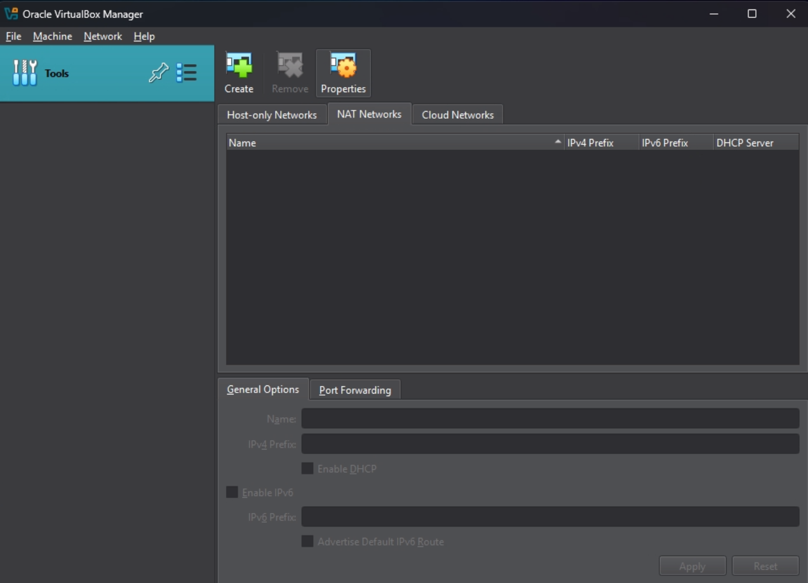

# VirtualBox Hybrid Cloud Lab

This document outlines the steps to create a hybrid cloud environment.

## Part 1: VirtualBox Network Configuration

This part focuses on setting up the necessary networks within VirtualBox.

1. **Open VirtualBox Manager:**
    - Open the VirtualBox application.

2. **Create NAT Network:**
    - Navigate to the NEtwork Manager: Go to 'Tools' -> 'Network'.

    