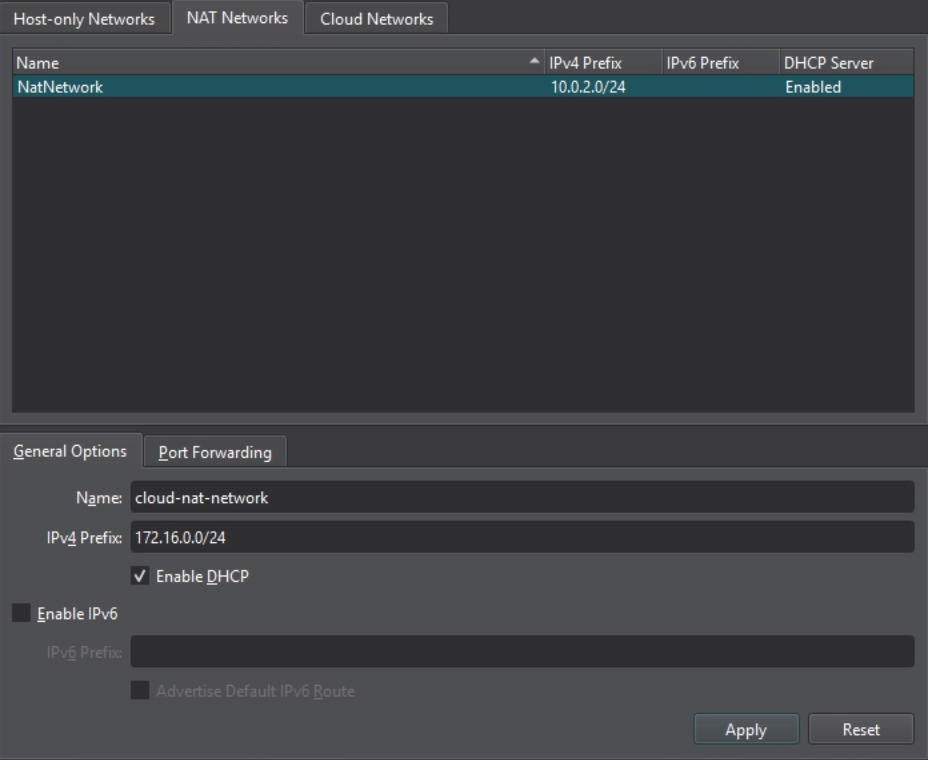
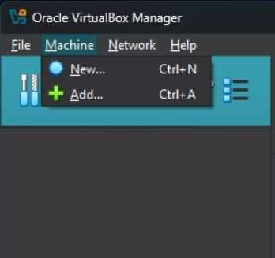
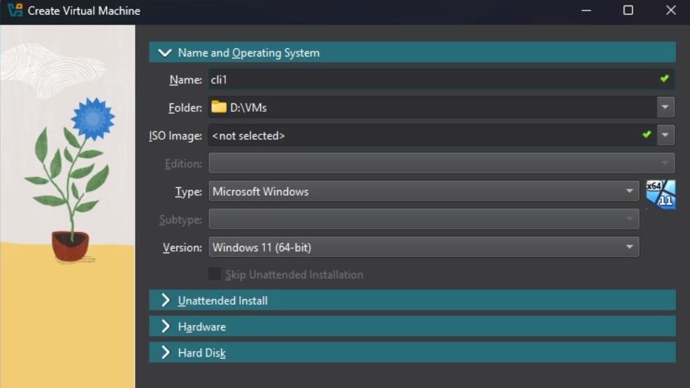
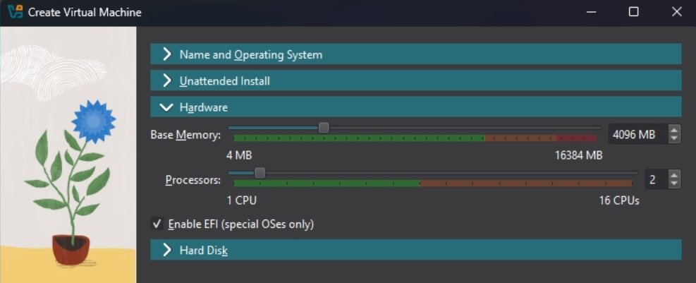
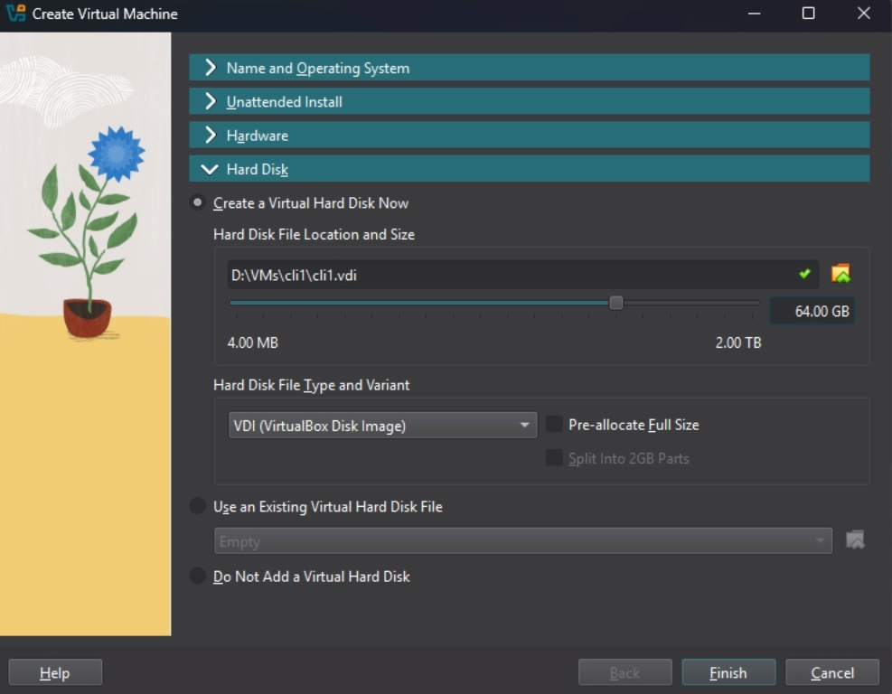
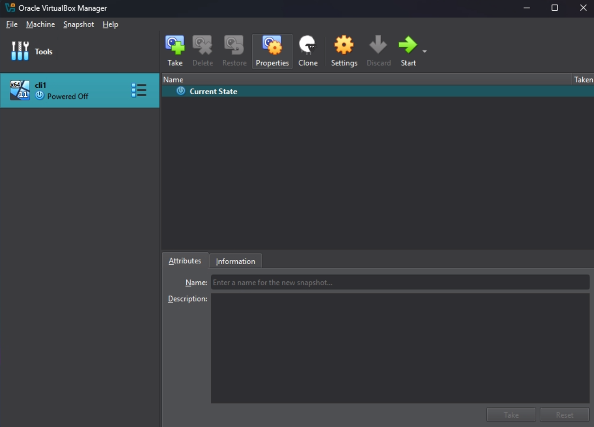
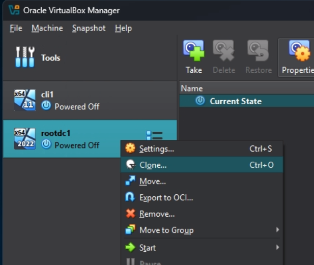
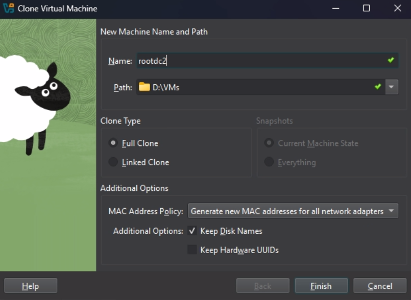

# VirtualBox Hybrid Cloud Lab

This document outlines the steps to create a hybrid cloud environment.

## Part 1: VirtualBox Network Configuration

This part focuses on setting up the necessary networks within VirtualBox.

1. **Open VirtualBox Manager:**
    - Open the VirtualBox application.

2. **Create NAT Network:**
    - Navigate to the NEtwork Manager: Go to 'Tools' -> 'Network'.
    - Select the "NAT Networks" tab.

    

    - Click the "Create" button to add a new NAT network.
    - Rename the newly created network to 'cloud-nat-network'.
    - Set the IPv4 Prefix to '172.16.0.0/24'.
    - Ensure that the "Enable DHCP" checkbox is checked.

    

    - Click "Apply"

    **Note:** Internal networks will be defined implicitly during the VM configuration process.

## Part 2: Create Virtual Machines

This part involves creating the eight virtual machines needed for the lab environment. We'll be using the new VM creation wizard in VirtualBox 7.x and the clone feature for efficiency.

1. **Create 'cli1' (Windows 11 Client):**
    - Click 'Machine' -> 'New' button in VirtualBox Manager.

    

    - In the "Name and Operating System" secion:
        - **Name:** 'cli1'
        - **Folder:** (Choose where to store the VMs)
        - **ISO Image:** (Leave blank)
        - **Type:** 'Microsoft Windows'
        - **Version:** 'Windows 11 (64-bit)'
        - **Skip Unattended Installation:** Ensure this is *unchecked*

    

    - Hardware
        - **Base Memory:** '4096 MB'
        - **Processors:** (Leave at default)

    

    - Hard Disk
        - **File Size:** '64 GB'

    

    - Click 'Finish' to create the virtual machine.

    

2. **Create 'rootdc1' (Base Windwos Server VM):**
    - Click 'Machine' -> 'New' in VirtualBox Manager.
    - In the "Name and Operating System" section:
        - **Name:** 'rootdc1'
        - **Folder:** (Same as previous)
        - **ISO Image:** (Leave blank)
        - **Type:** 'Microsoft Windows'
        - **Version:** 'Windows Server 2022 (64-bit)'
        - **Skip Unattended Installation:** Unchecked
    - Hardware
        - **Base Memory:** '2048 MB'
        - **Processors:** (Default)
    - Hard Disk
        - **File Size:** '50 GB'
    - Click "Finish"

3. **Clone 'rootdc1' to Create Other Server VMs:**
    - Right-click on the 'rootdc1' VM in the VirtualBox Manger and select "Clone...".

    

    - **Clone 'rootdc2':**
        - **Name:** 'rootdc2'
        - **Path:** (Same as previous)
        - **Clone Type:** 'Full Clone'
        - **MAC Address Policy:** Select "Generate new MAC addresses for all network adapters"
        - **Keep Disk Names:** Checked

    

        - Click "Finish"
    
    - **Repeat:** Repeat the cloning process for 'rootdc3', 'cdc1', crodc1', and 'acqdc1', changing the *Name* in the "Clone Virtual Machine" dialog each time, but keeping all other settings the same (especially "Generate new MAC addresses...").

4. **Create 'pfsense-router':**
    - Click 'Machine' -> 'New' in VirtualBox Manager.
    - In the "Name and Operating System" section:
        - **Name:** 'pfsense-router'
        - **Folder:** (Same as previous)
        - **ISO Image:** (Leave blank)
        - **Type:** 'Linux'
        - **Subtype:** 'Other Linux'
        - **Version:** 'Other Linux (64-bit)'
        - **Skip Unattended Installation:** Unchecked
    - Hardware
        - **Base Memory:** '1024 MB'
        - **Processors:** (Default)
    - Hard Disk
        - **File Size:** '10 GB'
    - Click "Finish"